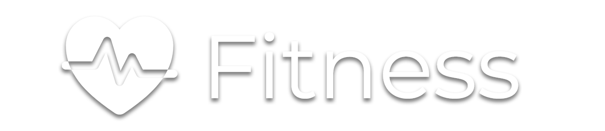

  

# Fitness-Landing-Page
The Fitness Landing Page is a web application designed to fitness business website. I decided to create it using React.js and Pure CSS. The landing page provides a visually appealing and user-friendly, animations interface to display Fitness services, package attracting potential visitors. The landing page is built using modern web technologies and is fully responsive for an optimal viewing experience across devices.

##Demo link
The demo live this project here - https://fitness-lp.netlify.app/

## Features

- Fitness landing page with stunning visuals.
- Responsive design for seamless viewing on various devices.
- Artistic animations and interactive elements for an engaging user experience.
- Smooth navigation between sections with the Navbar and scolling.

## Technologies & Tools Used
- React.js
- CSS
- Framer Motion
- SmoothScoller

# Installation and Usage
## Prerequisites
- Node.js and npm installed on your system.

To use this Fitness Landing Page, follow these steps:

- Clone the repository or download the source code.
- Open the project in your preferred code editor.
- Run `npm install` to install the necessary dependencies.
- Run `npm start` to start the development server.
- Open your browser and navigate to `http://localhost:3000` to access the app.

# Credits
A Fitness Landing page was inspired and designed by [Filllo Design Agency](https://dribbble.com/shots/20765972-Fitness-Landing-Page?utm_source=Clipboard_Shot&utm_campaign=filllo&utm_content=Fitness%20Landing%20Page&utm_medium=Social_Share&utm_source=Clipboard_Shot&utm_campaign=filllo&utm_content=Fitness%20Landing%20Page&utm_medium=Social_Share) They really did amazing design jobs.
